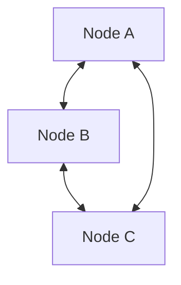
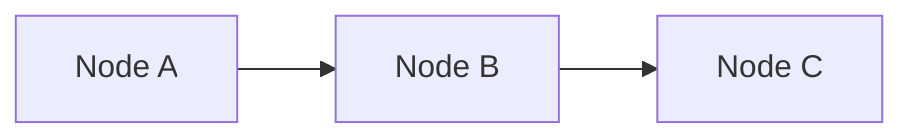
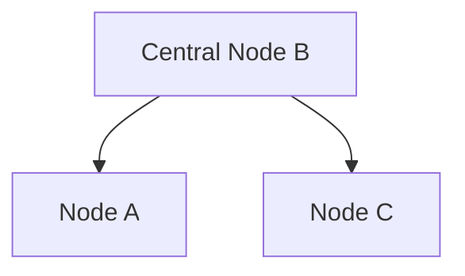
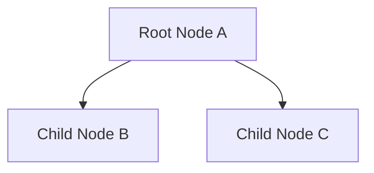

# Network Diagram

This is a simple network diagram with three nodes connected in a network topology.

## Diagram

## Description

- **Node A**: First network node
- **Node B**: Second network node
- **Node C**: Third network node

The nodes are fully connected, forming a mesh network topology where each node can communicate directly with every other node.

## Alternative Representations

### Linear Topology

### Star Topology

### Hierarchical Topology

